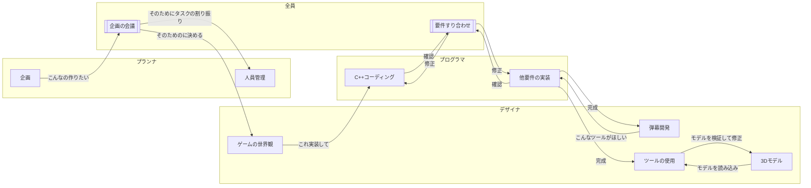

# エンジンの設計思想

## 目標 (優先度順)

- 3Dのサバイバル弾幕ゲームを作れること
- 新規で参加したエンジニアでも拡張しやすい設計にすること
- デザイナ,プランナが視覚的に扱いやすい設計にすること
- 3人以上6人未満の規模での開発がスムーズに行われるようにすること

【用語の意味/定義付け】  
- エンジニア  
  C++プログラムのコーディング,要件の実装をする人
- デザイナ  
  ゲームの世界観の設計,3Dモデル(アニメーションを含む)の作成,弾幕の開発をする人
- プランナ  
  企画書制作,開発スケジュールとタスクの管理をする人

## 目標実現のための必要機能

- ECS設計
  - 世界観  
    GameObject Component の構成から Entity Component System の構成に。  
    Gameobject,Component はデータと振る舞いをセットで持っている一方、  
    データをComponentに、更新処理をSystemに、データの所有識別子をEntityにする。  
    Componentは純粋なデータを持っている構造体になる。  
    これにより次の項目のメリットがある。
  - データ面
    様々なデータが乱雑にヒープ領域への動的確保をし、  
    同種データごとの更新処理でCPUのキャッシュ効率を下げてしまう従来の設計から脱却。  
    同種データ(コンポーネント)を配列配置し、データの局所性を上げ、線形アクセスを可能にすることで  
    CPUのキャッシュミスを最小限に抑える。
  - エンジン設計面
    同種コンポーネントが配列配置になったことで、アドレスがバラバラなポインタアクセスを排除。  
    配列のインデクスでアクセスできるため、特定の型(GameObjectの派生型)を知る必要がなくなった。  
    そのため、ワールド(シーン)データのシリアライズと、その読み書きを簡単に実装できた。

